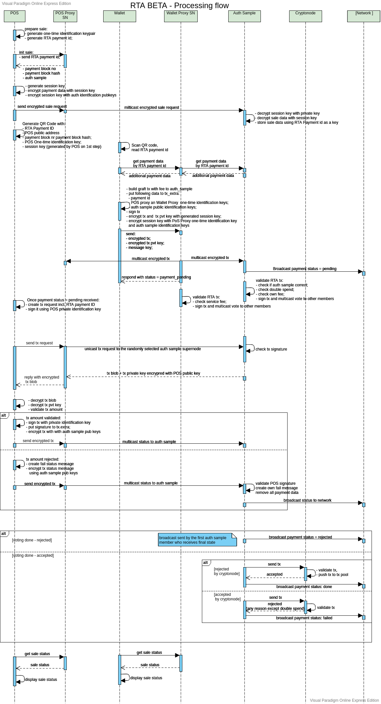

<h1 align="center">RTA Transaction Validation Flow</h1>
<h3 align="center">Draft, v0.2</h3>

***

### Change Log
| Date       | RFC Version |
|------------|-------------|
| 01/09/2019 | 0.1         |
| 01/18/2019 | 0.2         |
| 06/18/2019 | 0.3         |

***
1. [Validation Flow Sequence Diagram](#validation-flow-sequence-diagram)
 
2. [RTA Transaction](#rta-transaction)

3. [RTA Transaction Validation](#[rta-transaction-validation])

    3.1 [RTA Transaction Validation by PoS](#rta-transaction-validation-by-pos)
  
    3.2 [RTA Transaction Validation by Auth Sample Supernode](#rta-transaction-validation-by-auth-sample-supernode)
  
    3.3 [RTA Transaction Validation by Proxy Supernodes](#rta-transaction-validation-by-proxy-supernodes)
  
    3.4 [Blockchain RTA Transaction Validation](#blockchain-rta-transaction-validation)
  
4. [Validation Flow Description](#validation-flow-description)


## Validation Flow Sequence Diagram



> **Open Issue**
>
> - **Fake Transaction Protection for RTA Validation**: We should guarantee that user cannot submit the regular transaction with the same tx key images as in RTA transaction (potential double-spent) in pre-mined blocks after successful RTA validation to double-spent RTA transaction. The best solution at this moment is lock regular transaction and validate all transactions through auth sample.
> - **RTA transaction containing more than one Graft transactions**

## RTA Transaction
RTA Transaction is an extended version of the regular transaction which requires RTA validation by PoS, authorization sample and proxy supernodes (PoS and Wallet.) Since, in case of RTA validation, an additional fee is to be paid to authorization sample and proxy supernodes, RTA Transaction is always a multi-destination transaction, and transaction amount sent to PoS is calculated using the formula:

```ruby
RtaTxAmount = FullTxAmount - ASSize * ASFee - PoSProxyFee - WalletProxyFee
```
where **FullTxAmount** - full transaction amount, **ASSize** - Auth Sample Size - the number of supernodes in the authorization sample, **ASFee** - Auth Sample Fee - validation fee for one authorization supernode, **PoSProxyFee** - PoS Proxy Supernode Fee - service fee for PoS Proxy Supernode, and **WalletProxyFee** - Wallet Proxy Supernode Fee - service fee for Wallet Proxy Supernode. RTA transaction must include several additional data fields:

* **RTA payment ID**, which identifies this payment in the Graft Network;
* **PoS public one-time identification key**, required for RTA validation by PoS;
* **Auth sample public identification keys**, required for RTA validation by auth sample supernodes;
* **PoS and Wallet Proxy Supernode public identification keys**, required for service fee validation for RTA Transaction by PoS and Wallet Proxy Supernodes.

Transaction private key must participate in RTA Transaction. However, in the sake of privacy, the key should not be added to transaction extra data and is to be provided separately. The transaction and transaction private key must be encrypted, using [Multiple Recipients Message Encryption](%5BRFC-001-GSD%5D-General-Supernode-Design.md#multiple-recipients-message-encryption).

## RTA Transaction Validation
RTA Transaction must be validated by PoS, authorization sample supernodes and proxy supernodes. During RTA validation all of them own different goals. PoS validates the amount of the transaction. Each auth sample supernode validates key images of RTA transaction (classical double-spent check) and the validation fee.
PoS and Wallet Proxy Supernodes validate the service fee.

### RTA Transaction Validation by PoS
When PoS receives RTA transaction data for RTA validation, it performs the following operations:
1. Decrypts received RTA transaction data:

   1. Decrypts message key using its private one-time identification key.
   
   2. Decrypts RTA transaction and transaction private key using message key.
2. Checks amount in the transaction, using transaction private key and PoS public wallet address based on [Monero Prove Payment Mechanism](https://www.getmonero.org/resources/user-guides/prove-payment.html).

### RTA Transaction Validation by Auth Sample Supernode
When a supernode in auth sample receives RTA transaction data for RTA validation, it performs the following operations:
1. Decrypts received RTA transaction data:

   1. Decrypts message key using its supernode private identification key.
   
   2. Decrypts RTA transaction and transaction private key using message key.
2. Checks correctness of selected auth sample using payment block hash and RTA payment ID.
3. Validates transaction key images (double-spent check) in the blockchain, transaction pool and the list of currently processing RTA Transaction on supernode.
4. Checks the validation fee using transaction private key and its supernode public wallet address based on [Monero Prove Payment Mechanism](https://www.getmonero.org/resources/user-guides/prove-payment.html).

### RTA Transaction Validation by Proxy Supernodes
When PoS or Wallet Proxy Supernode receives RTA transaction data for RTA validation, it performs following operations:
1. Decrypts received RTA transaction data:

   1. Decrypts message key using PoS or Wallet Proxy Supernode private identification key.
   
   2. Decrypts RTA transaction and transaction private key using message key.
2. Checks the service fee, using transaction private key and proxy supernode public wallet address based on [Monero Prove Payment Mechanism](https://www.getmonero.org/resources/user-guides/prove-payment.html).

### Blockchain RTA Transaction Validation
To validate RTA Transaction graftnode should perform several checks:
1. Checks correctness of auth sample for transaction validation. For this, graftnode gets Blockchain-based List and checks if selected auth sample supernodes listed in the transaction are eligible to participate in auth sample for this transaction.
2. Checks PoS signature.
3. Checks auth sample supernode signatures.
4. Checks PoS and Wallet Proxy Supernode signatures.
5. Regular key image checking (double spent checking.)

## Validation Flow Description

1. PoS generates PoS one-time identification keypair and RTA payment ID based on PoS public one-time identification key.  Then PoS requests auth sample from Proxy Supernode, passing  RTA payment ID to it (`/dapi/presale` endpoint). Proxy Supernode returns:

   1. payment block number

   2. payment block hash

   3. and Auth Sample Data (**8 pairs of the supernode public identification key and public wallet address**, see [Selecting Auth Sample Supernode List](#https://github.com/graft-project/DesignDocuments/blob/master/RFCs/%5BRFC-002-SLS%5D-Supernode-List-Selection.md#selecting-auth-sample-list))

   4. Pos Proxy id and wallet address;
   
      > **Note:** To validate the correctness of Auth Sample Data, PoS may ask it from different Proxy Supernodes
   
      > **TODO:** _Boris:_ I'm leaning towards trusting PoS proxy with respect to auth sample but use the PoS one-time identification keypair to enforce anonymity.
   
    >**Payment Block Definition**
    >
    >  **Payment block** is a historical block in the blockchain, which selected by the block number as a difference between current blockchain height and constant value, which determines the delay for increasing the stability of selected auth sample (Currently we use SVP). Formally,`payment_block_number = current_block_number - SVP`. Block defined by using its block number and block hash.

    > **Purchase details**  is an information about purchase - may include list of pushase items, price and amount of each item, etc

    > **Payment data** is a data structure containing **encrypted purchase details** and total amount  (**FullTxAmount** in atomic units)

2. When PoS got data from Proxy Supernode, it prepares and sends **encrypted payment data** (to `/dapi/sale` endpoint):
    * ~~generates the symmetric encryption key, called **PoS data encryption key**. This key will be only passed to Wallet app (only Wallet app can read this payment details)~~
        > NOTE: for now we don't have an interface do encrypt/decrypt with symmetric keys and error handling, so it's ok to re-use `graft::crypto_tools::encryptMessage` to encrypt payment data for wallet: PoS will generate one-time keypair, encrypt and pass private key (instead of symmetric encryption key) via QR Code.
    * generates one-time keypair to encrypt **purchase details** for wallet app (WalletSecretKey, WalletPubKey);
    * serializes **purchase details** and encrypts it using [Multiple Recipients Message Encryption](%5BRFC-001-GSD%5D-General-Supernode-Design.md#multiple-recipients-message-encryption) with only WalletPubKey;
    * builds **payment data** (encrypted purchase details with total amount), serializes and encrypts it using [Multiple Recipients Message Encryption](%5BRFC-001-GSD%5D-General-Supernode-Design.md#multiple-recipients-message-encryption) with auth sample public keys: ~~PoS generates random message key, encrypts payment data using the message key, then encrypts message key for each supernode in the auth sample, using supernode public identification keys~~ (currenty implemented in cryptonode's `graft::crypto_tools::encryptMessage` interface so PoS doesn't need to deal with encrypted session key, it embedded into encrypted message); This way Supernodes who receive this message can only read total amount but not purchase details;
    * sends **encrypted payment data** ~~and encrypted message key~~ in the sale request to the Proxy Supernode to be multicasted by Proxy Supernode to auth sample supernodes.

        >`message key embedded into encrypted message and handled by graft::crypto_tools::encryptMessage/graft::crypto_tools::decryptMessage interfaces`
    
3. Proxy Supernode receives sale request from PoS and multicasts it to all supernodes in the auth sample. Supernodes in the auth sample decrypt encrypted **Payment data**  using their private identification keys and store encrypted **Payment data** and **decrypted amount** using RTA payment ID as a key;

>**Communication Message Encryption** 
>
>  **Communication Messages** (Unicast, Multicast and Broadcast) should be always signed by its sender. Sender field in the message should be set to the sender public identification key and the signature must be add in signature field in the message. The signature is generated using the sender private identification key.


4. At the same moment, **PoS** generates QR code for Wallet including RTA payment ID, _PoS public address_, payment block number, payment block hash, _PoS public one-time identification key_ and PoS data encryption key into it.


> **Note:** I think we need to optimize data in QR code, however, it can decrease security since we must send more data over the network.

5. **Wallet** scans QR code, gets RTA payment ID, payment block number and payment block hash from it and asks (`/dapi/get_payment_data` endpoint) its Wallet **Proxy Supernode** (can be any supernode in the network) for additional payment data (encrypted serialized payment data, PoS and Wallet Proxy Supernode public identification keys and public wallet addresses, Auth Sample Data). 

6. **Wallet Proxy Supernode**
   1. receives wallet request
   2. looks up for additional payment data and auth sample by payment id
   3. builds auth sample using RTA payment ID, payment block number and payment block hash and validates auth sample,  retrived with payment data, against auth sample, generated by payment id and block number;
   4. returns encrypted serialized payment data, Auth Sample Data (**8 pairs of the supernode public identification key and public wallet address**, see [Selecting Auth Sample Supernode List](%5BRFC-002-SLS%5D-Supernode-List-Selection.md#selecting-auth-sample-list)), PoS and Wallet Proxy Supernode public identification keys and public wallet addresses.

7. If **Wallet Proxy Supernode** doesn't have encrypted serialized payment data and PoS Proxy Supernode public identification key and public wallet address:   
 
    1. it builds Auth Sample and requests the data from one of the randomly selected supernode in the auth sample. The request is sent as a unicast async message to the remote supernode. 
    2. remote supernode replies on this request and returns **encrypted payment data** (**encrypted purchase details** and total amount). **Payment data** encrypted with the public identification key of a supernode who requested the data. The reply is sent as a unicast async message.

8. **Wallet**
    * builds graft transaction, distributing fee over auth sample and **Proxy Supernodes** (more details on that can be found in the whitepaper);
    * stores **RTA payment ID**, **PoS public one-time identification key** (used to identify PoS in the network and protect data for it), **auth sample supernode public identification keys** (graftnode will need it to validate auth sample signatures), **PoS** and **Wallet Proxy Supernode identification keys** to **transaction_header.extra**.
    * signs transaction,
    * encrypts transaction blob and transaction private key using [Multiple Recipients Message Encryption](%5BRFC-001-GSD%5D-General-Supernode-Design.md#multiple-recipients-message-encryption) for PoS, auth sample supernodes and proxy supernodes, and
    *  proxy supernodes, and
    * sends encrypted transaction blob, encrypted transaction private key and encrypted message key to the Wallet **Proxy Supernode** (`/dapi/pay` endpoint).
    
9. Once Wallet **Proxy Supernode** receives wallet request with the encrypted transaction blob and transaction private key, it multicasts encrypted transaction, encrypted transaction private key and encrypted message keys to the **auth sample supernodes** and **proxy supernodes**.

10. Every supernode in the auth sample, upon receiving an encrypted transaction blob (`/core/authorize_rta_tx` endpoint), encrypted transaction private key and encrypted message key, does next operations:
    1. broadcasts signed pay status with status = **payment_pending** (`/core/update_payment_status` endpoint) over the **P2P network** 

    >**Note:** Can be done by Wallet Proxy Supernode when/if we provide a mechanism for Proxy Supernode validation?
    
    2. checks correctness of the selected auth sample using payment block hash and RTA payment ID, if it is incorrect, supernode rejects the transaction,
    3. validates transaction by checking its own fee amount and by checking if tx key images of the transaction already exist in the blockchain, transaction pool or the list of RTA transactions currently processed by supernode (double-spent check),
    4. multicasts the signed transaction to other supernodes in the auth sample(multicast message to be handled by `/core/authorize_rta_tx` endpoint).

11. Once PoS or Wallet Proxy Supernode > **TODO:** _Ilya:_ As wallet proxy is the first one who started to sending this multicast, can it simply do all validations and sign tx at p.9? receives encrypted transaction blob, encrypted transaction private key and encrypted message key, it:

    1. validates its service fee and
    
    2. if validation passes, proxy supernode signs transaction with its private identification key,
    
    3. stores it in transaction extra data field and
    
    4. multicasts the signed transaction to the auth sample.
        
12. When **PoS** receives pending payment status, it:
    1. creates the transaction request including RTA payment ID,
    2. signs it using its PoS private one-time identification key
    3. adds the signature to request and
    4. sends the request to Proxy Supernode (`/dapi/get_tx` endpoint).
        
13. When Proxy Supernode receives the transaction request, it randomly selects supernode in the auth sample and unicasts transaction request to it (`/core/tx_request` endpoint).

14. An auth sample supernode, upon receiving the transaction request,
    1. checks the signature using PoS public one-time identification key, which included in transaction_header.extra
    2. if the signature is valid, gets transaction blob and transaction private key, encrypts those using the PoS public one-time identification key, and
    3. sends encrypted transaction blob and transaction private key to the PoS Proxy Supernode.
    
15. PoS **Proxy Supernode** receives the answer from an auth sample supernode, sends encrypted transaction blob and transaction private key to the **PoS** (responds to `/dapi/get_tx` endpoint).

16. When **PoS** receives encrypted transaction blob and transaction private key, it
    1. decrypts transaction blob and transaction private key using its private PoS one-time identification key,
    2. validates the transaction and amount,
    3. if the validation pass, PoS
       1. signs transaction using its PoS private one-time identification key,
       2. adds the signature to the **transaction.rta_signatures**,
       3. encrypts transaction using [Multiple Recipients Message Encryption](%5BRFC-001-GSD%5D-General-Supernode-Design.md#multiple-recipients-message-encryption) for auth sample supernodes, and
       4. sends the encrypted transaction to its Proxy Supernode.
    4. if the transaction is invalid, PoS
       1. creates "status fail" message, including status and signature generated using the PoS private one-time identification key,
       2. encrypts signed "status fail" message using [Multiple Recipients Message Encryption](%5BRFC-001-GSD%5D-General-Supernode-Design.md#multiple-recipients-message-encryption) for auth sample supernodes, and
       3. sends the encrypted status message to its Proxy Supernode.
        
17. When Proxy Supernode receives the encrypted transaction or the encrypted "status fail" message from PoS, it multicasts data to the auth sample supernodes.

18. Authorization sample supernodes receive the message from Proxy Supernode and process it:
    1. if supernode receives the "status fail" message from PoS, it validates PoS signature using PoS public one-time identification key, included in the RTA transaction. If it's invalid, supernode rejects status message; otherwise, it creates own "status fail" message, signs the latter, broadcasts it over the network and removes all data related to the payment.
    2. if supernode receives transaction signed by PoS, it validates the signature and if it's valid, supernode stores PoS transaction signature.

19. Each **supernode** in auth sample, upon receiving a notification from other auth sample supernodes, PoS, PoS Proxy Supernode, and Wallet Proxy Supernode, handles it by checking **signatures**:
    > **Consensus of Approval (CoA)**: 
    >
    > Transaction considered valid as soon as
    >    * supernode receives a **valid** PoS signature,
    >    * supernode receives at least 6 out of 8 approvals until the validation timeout,
    >    * supernode receives valid PoS and Wallet Proxy Supernode signatures.

    > **Consensus of Rejection (CoR)**: 
    >
    > Transaction considered invalid as soon as
    >    * supernode receives an **invalid** PoS signature (fail status message from PoS),
    >    * supernode receives a rejection from some auth sample member,
    >    * supernode receives a rejection from PoS or Wallet Proxy Supernodes.
    
    1. When any auth sample supernode gets in:
        1. the final approval state (**receives 8 auth sample approvals, PoS approval, PoS and Wallet Proxy Supernode approvals**), it fills rta_signatures and sends RTA transaction to its graftnode; 
        2. the final rejection state (**PoS Rejection, PoS or Wallet Proxy Supernode rejection, or at least one auth sample supernode rejection**), it broadcasts failed pay status over the network.
    2. When any auth sample supernode gets in the validation timeout state, it
        1. checks Consensus of Rejection and if it passes, supernode broadcasts failed pay status over the network;
        2. checks Consensus of Approval and if it passes, supernode fills **rta_signatures** and sends RTA transaction to its graftnode;
        3. if supernode cannot pass both consensuses, it broadcasts failed pay status over the network.
           
           > **Transaction Submission Warning**
           >
           > The most of the supernodes who voted transaction will be sent transaction to pool simultaneously and will obviously get "double spend" error, so in case some supernode will receive double spend here - it just ignores it.

20. **Graftnode** that handles RTA transaction validates:
    1. The correctness of the selected auth sample;
    2. PoS signature;
    3. Signatures from each auth sample's member (must be at least 6 out of 8 valid signatures);
    4. Wallet and PoS Proxy Supernode signatures;
    5. The transaction itself (as usual).
    
21. Once graftnode accepts the transaction, supernode, which submitted it to the graftnode, broadcasts successful pay status over the network.

22. Each supernode handles status update message, checks signature and updates status for given payment only if signature validation passes. Each supernode which sent the request for a status update must sign this request using its private identification key.

23. Wallet and PoS request their proxy supernodes or any other supernode to update their status.
