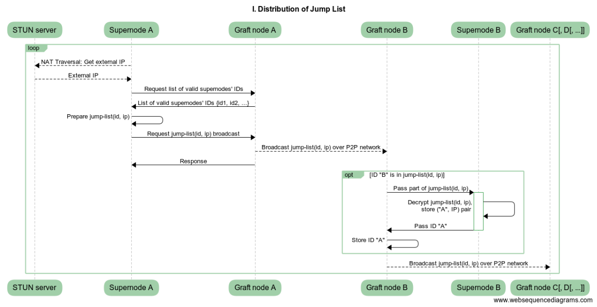

# Communication options


## Current state and motivation

Original P2P network is used for communication between supernodes. Announcements (messages of a special type) are periodically broadcast by every peer and are used for both keeping lists of active peers and building paths (tunnels) between the peers. Apperentlly, such approach induces a higher value traffic in the network.

Yet another, less critical but still important, issue is present in the current approach. Even though peers in the original P2P network have discoverable IPs, the complexity of IP discovery is exponential with respect to the number of peers in the network. However, any attempt to build a preferable path between 2 peers makes this complexity linear. The latter opens up door to DOS attacks on the list of supernodes authentication sample to be selected from.

Those issues were raised by *@jagerman* (see [#187](https://github.com/graft-project/graft-ng/issues/187)). The following document lists several approaches we considering, addressing the concerns.


When we first started working on issue, we were mainly focused on _Option 1_ since it would allow us to reduce the amount of traffic without making significant changes to current design. Options 3 and 4 were also under consideration. At the same time we started work on disqualification transactions design -- this mechanism means to be used in any case. Later, however, digging into _Options 3_ and _4_ brought us to _Option 2_, which we believe is the most optimal solution taking into account all practical considerations. 

**Publishing this document we would like to hear reaction of the community before making the final decision.**

Since there are still a few open issues, the estimates provided below are preliminary and may be changed if development scope needs to be extended.


## Optimization


### P2P broadcast optimization

We can reduce the amount of traffic (both keep-alive and data messages) during P2P broadcasts by

1.  Making it random for a peer to re-transmit a message further to the neighbors (same messages will not be re-transmitted by that peer but may be re-transmitted by a neighbor);
2.  Making it random for a peer to forward a message further to a particular neighbor (the message will be forwarded to a random subset of the neighbors);
3.  Reduce frequency of periodic broadcasts.

Reducing frequency of announcements, we, however, make both peer monitoring and building tunnels less robust.


### Disqualification transactions

Disqualification transaction is a special type of timed transactions in the blockchain, used to prevent a disqualified supernode from being selected to participate in an authorization sample. There are two mechanisms to issue a disqualification transaction:

1.  Every (second?) block randomly selected disqualification quorum "pings" a randomly selected supernodes from the set of supernodes with stack transactions in the blockchain and vote for disqualification of dead nodes.
2.  After an RTA transaction verification, authorization sample vote for disqualification of a supernode that didn't submit its vote or were late to vote during transaction verification.

Both mechanisms can be used either in conjunction or on their own.

## Proposed Design: Jump List

### Preconditions

*   No announcements in their current form;
*   P2P broadcast optimization;
*   Disqualification transaction mechanism.

### High level design

1.  Upon a supernode joining the network, it retrieves the list of public identification keys from the blockchain (active supernodes), encrypts its public identification key and IP using keys from a randomly selects subset, and broadcasts the encrypted data (jump list) over P2P network.
2.  Every few hours the supernode checks the selected supernodes are still active, and reselect inactive nodes. Then it repeats the broadcast procedure, described above.
3.  When sending a message, a supernode broadcasts it over P2P network. Broadcast is limited by a maximal number of hops. When the message reaches a node that knows recipient's IP, it's forwarded directly to the recipient.
4.  The recipient receives multiple copies of the same message, and should be able to handle this situation gracefully, with no noticeable performance degradation.


On the figure above node A sends a message, addressed to node B. Nodes R retransmit the message issued by A. Nodes T terminate the broadcast, assuming 2 hops are allowed. DR nodes know IP of node B. 

There are two very relevant parameters: hop limit `H` and size of randomly selected subset of supernodes `L`. Assuming uniform distribution sampling and S to be a number of valid supernodes, one can see that `H < [S/L] + 1`.


### Jump List
```
jump-list(sender-pk, sender_ip) = [plain-size:4][jump-list-pk:32][jump-list-size:2][recipient-pk-short:4][key:32]...[recipient-pk-short:4][key:32][data],
```
where `*-pk` and `*-sk` are public and secret keys,
```
key = tmp-sk ^ Hs(jump-list-sk * recipient-pk),
data = chacha8(tmp-sk, magic-byte || sender-ip || sender-pk || magic-byte),
```

### Sequence Diagrams




